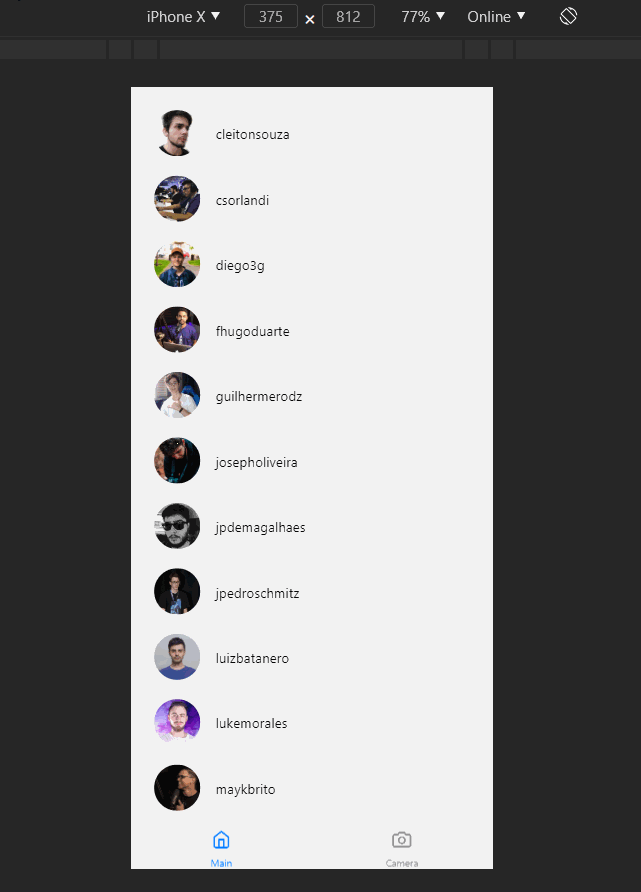

<h1 align="center">
    
</h1>

<h2 align="center"> Uma aplicação PWA </h2>

---

## Tela aplicação web 

	

## Aplicação mobile

	

<h2><strong>:satellite: tecnologias utilizadas:</strong></h2>

<h3>ReactJS  </h3>
<h3>Expo<h3>

<h4>Dúvidas entre em contato pelo <a href="https://www.linkedin.com/in/marco-antonio-monteiro-de-brito-541ba0144/" target="_blank">Linkedin</a> </h4>

<h4 align="center"> <em>&lt;/&gt;</em> by <a href="https://github.com/marcomonteirobrito" target="_blank">marcomonteirobrito</a> </h4>